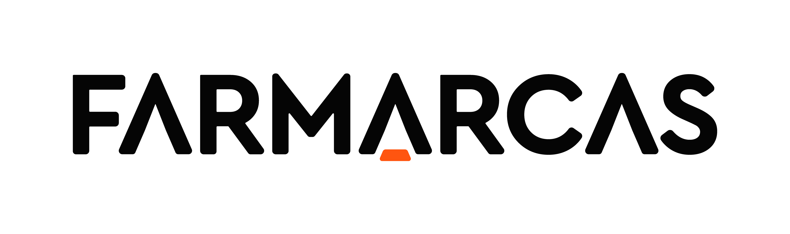

# Agenda Pasquali API

Este projeto é uma API para gerenciamento de agendas, desenvolvida com Laravel 11 e MySQL 8.0. Ele permite criar, listar, atualizar e excluir eventos na agenda. Abaixo estão as instruções para configuração, execução e uso da API.

## Requisitos

- Docker

## Instalação

### Clonando o Repositório

```bash
git clone https://github.com/linsmarcruz/agenda-pasquali-api.git
```

### Instalando Dependências
Execute o seguinte comando para acessar o diretório do projeto e instalar as dependências:

```bash
cd agenda-pasquali-api
./vendor/bin/sail up
```

### Configurando o Ambiente
Copie o arquivo .env.example para .env e configure as variáveis de ambiente:

```bash
cp .env.example .env
```

Edite o arquivo .env com suas configurações de banco de dados e outras variáveis necessárias.

### Migrando o Banco de Dados
Execute Attach Shell no container do Laravel/PHP (Ex.: sail-8.3/app) para acessar o container e execute o seguinte comando para aplicar as migrations

```bash
php artisan migrate
```

## Executando Testes

### Configuração do Ambiente de Testes

Crie um arquivo .env.testing e configure as variáveis de ambiente para o ambiente de testes.
```bash
cp .env .env.testing
```

Edite o arquivo .env.testing com as configurações apropriadas, como o banco de dados de testes.

### Executando os Testes
Execute o seguintre comando dentro do container no php

```bash
php artisan test
```

### Gerando Documentação Swagger
Para regerar a documentação Swagger, execute:

```bash
php artisan l5-swagger:generate
```

A documentação estará disponível em:

```bash
http://localhost/api/documentation
```

teste